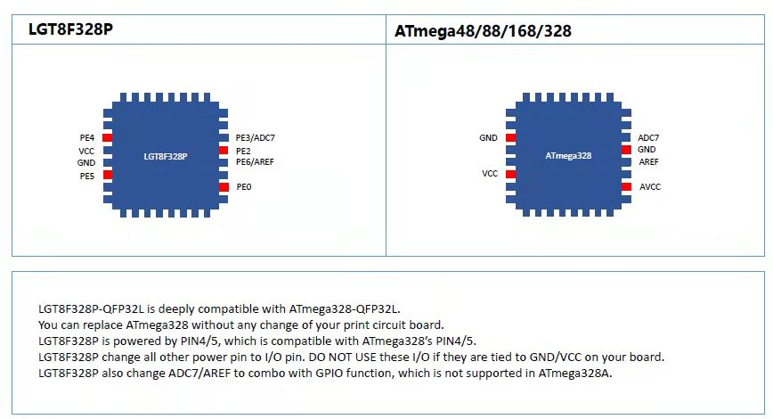

**[中文](README_zh.md)**
# Arduino Hardware Support Package for LGT8F's 

Automatic IDE integration is supported via the
Arduino Boards Manager. This is the recommanded way of installation now. 

Start the Arduino-IDE. In *File->Preferences*, *Settings* tab, enter

> https://raw.githubusercontent.com/nulllaborg/arduino_nulllab/master/package_nulllab_boards_index.json

as an *Additional Boards Manager URL*.

- Open *Tools->Board:...->Boards Manager*

- Find arduino_nulllaba by typing 'ch' into the search line

* Click on the list entry
* Click on *Install*.

Now you should find a new entry *nulllab avr compatible boards* in the list at
*Tools->Board:...*

* Choose *nulllab boards* from the list

### Task status

- [x] PWM & Timers update
- [x] Fast_IO update(/libraries/BasicsExamples/examples/FastIO/FastIO.ino)
- [x]  [Support timer3](./libraries/MsTimer3/examples/FlashLed/FlashLed.ino)
- [ ] Analog Comparator
- [ ] Differential Amplifier update 
- [ ] Computation Accelerator

### Summary

arduino_nulllab is a 3rd party hardware support package for the LGT8F core based arduino boards. The backend of the **HSP** is fork from offical arduino distribution. We have try to keep all the standard features compatible with arduino world. So feel free to resuse all of the libraries which designed for arduino platform.

Microcontroller based on LGT8F, e.g LGT8F328P has more advanced features which not covered in standard arduino implementation. so there are also many new features merged to this 3rd party package. Important update and new features as following:

* *External/Internal crystal can be selected at runtime*

* *Fast_IO interface for fast I/O speed and small code size*

* *Full configurable PWM features, including complementary and dead-band control*

* *Differential Amplifier front-end for 12bit Analog-to-Digital converter*

* *1/2 channel 8bit Digtial-to-Analog output, campatible with `analogWrite()`*

* *More standalone I/Os*

### Pin Different

### Bootloader 
The LGT8F328P bootloader is based on optiboot. Source can be found inside the [bootloader directory](./lgt8fx8p)

* *Bootloader upload baudrate: 115200bps*
* *Fix CH340G download unstabitily*

## Thanks

- [Larduino_HSP](https://github.com/LGTMCU/Larduino_HSP) for make code base
- [lgt8fx](https://github.com/dbuezas/lgt8fx)  for make more functions and fix bugs

