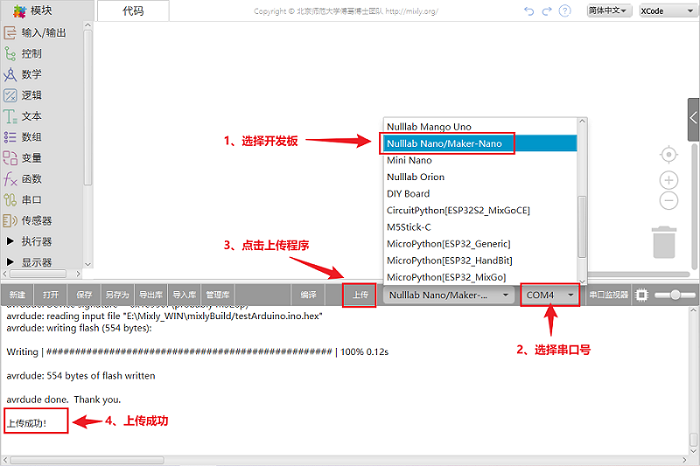
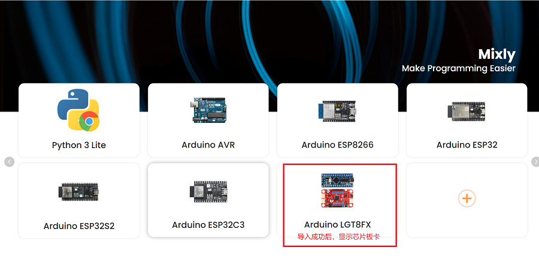
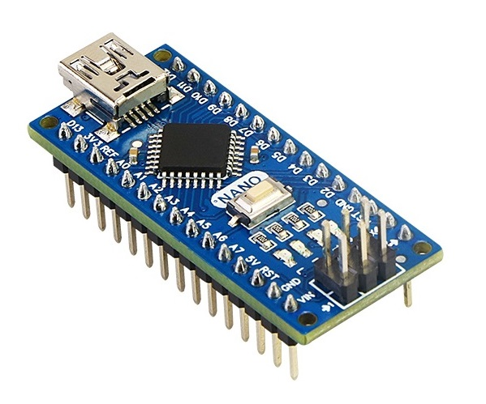
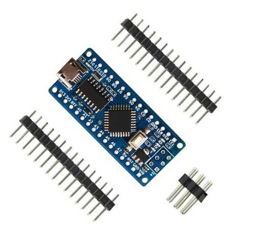
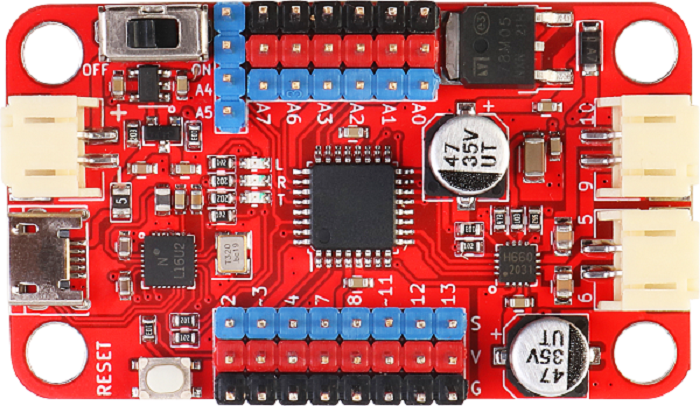
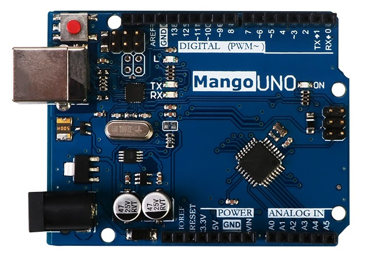
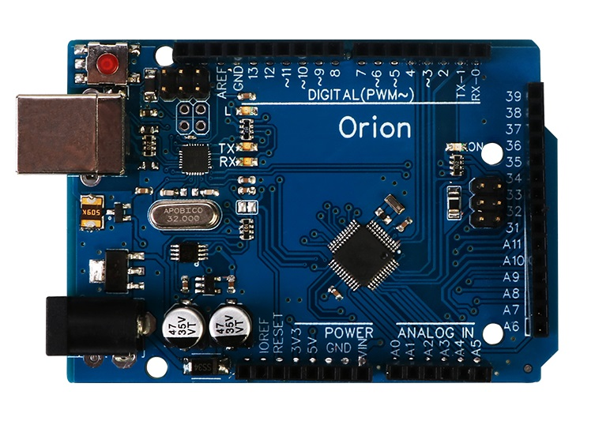
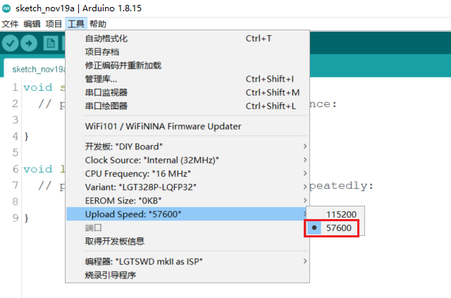
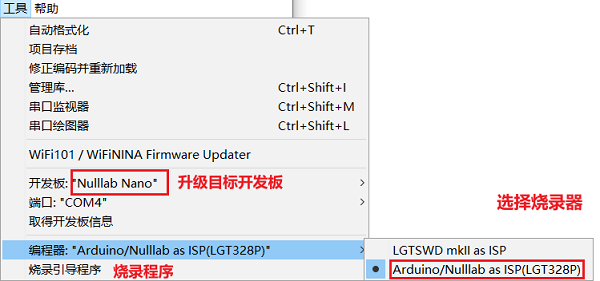

**[English](https://github.com/nulllaborg/arduino_nulllab/blob/master/README.md)**

## 写在之前

​    arduino uno R3自发布至今已有10多年，早已风靡全球，它的主控采用的是Atmel公司的Atmega328P主控，这是一颗基于AVR架构的8位单片机，面世有数十年了。得益于arduino完整软硬件生态，基于arduino uno的产品和项目不计其数。但是真正采用Atmega328P来量产的项目，却很少，因为这个芯片性价比很低。今年芯片缺货，导致对创客生态影响也很大，偶然的机会了解到[LogicGreen](http://www.lgtic.com/)的LGT8F328P，发现这是一款国产指令集兼容 AVR，Atmega328P的芯片，经过严格测试，发现能够99%兼容Arduino IDE。Nulllab团队是专门基于国产芯片做开发板的自由技术组织，为此我们专程拜访了LGT公司，和这颗芯片设计者详细了解到，这是一颗增强8位RISC内核，针对原来架构的做了优化，指令执行速度快了一些，同时优化了flash部分，增加定时器3，内置晶振，增加DAC输出，主频最高可到32M，功耗更低。反正就是把一些现代IC设计的一些主流技术应用在老的AVR框架上，出来也有5年多了，但是一直没怎么大规模替代atmega328P来做arduino产品，因为当时大家对国产的芯片天然不信任，以为这是山寨克隆版，实际这是一颗兼容芯片，类似于GD32之于STM32一样。LGT公司发展至今也早已有其他产品线，所以重心也没有全部放在兼容arduino的生态上，[官方SDK]()也在2019年后已经停止更新维护，[国外有个开源项目](https://github.com/dbuezas/lgt8fx)还在更新。nulllab技术团队大部分来自国际一线芯片原厂，已在创客开源软硬件行业沉浸多年。决定为国产创客软硬件生态做一点事情，我们先从LGT系类芯片做起，继续基于官方SDK做优化升级

## Nulllab软件包特点

​    官方sdk也好，还是国外另外一个软件包，其实都没有做到百分之百兼容原生的arduino，特定应用还是存在有bug，nulllab团队致力于解决这些bug，并且把LGT8F328P相对于Atemag328P增加的功能添加进来，发挥这颗芯片的最大性能。那么对于小批量的产品而言，完全可以采用这个芯片来用Arduino IDE的方式开发产品，将大大简化开发难度。

打勾的代表已经实现并验证，没有打勾的代表正在开发中，期待更多开发者一起维护
- [x] [去掉停产D后缀系类的芯片](https://github.com/nulllaborg/arduino_nulllab/commit/48fd6c3)
- [x] [DIY模式支持主频选择](./lgt8f/cores/lgt8f/main.cpp#L126)
- [x] [DIY模式支持外部晶振配置选择](https://github.com/nulllaborg/arduino_nulllab/commit/9c7a2d9)
- [x] [ADC参考电压选择,默认10bit精度,兼容官方API](https://github.com/nulllaborg/arduino_nulllab/commit/78371c9)
- [x] [修复CH340G芯片下载程序概率失败](https://github.com/nulllaborg/arduino_nulllab/commit/577666d)
- [x] [精准延时](https://github.com/nulllaborg/arduino_nulllab/commit/7a9b5e)
- [x] (增强型功能) [兼容Arduino EEPROM API](https://github.com/nulllaborg/arduino_nulllab/commit/60e8c6d) DIY模式EEROM大小可以自由选择0,2,4,8KB 
- [x] [Arduino uno/LGT As ISP下载器使用](./libraries/Lgt328P_ISP/README.md)
- [x] (增强型功能) [支持timer3](./libraries/MsTimer3/examples/FlashLed/FlashLed.ino)
- [ ] (增强型功能) [快速ADC]()
- [x] (增强型功能) [快速IO口](./libraries/BasicsExamples/examples/FastIO/FastIO.ino) 减少代码体积，大大提升执行效率
- [ ] (增强型功能) [2~6引脚80mA电流输出]()
- [ ] (增强型功能) [把AREF引脚当作A10]()
- [x] (增强型功能) [低功耗电源管理](./libraries/PMU/examples/PMU_PowerOff/PMU_PowerOff.ino)
- [ ] (增强型功能) [DAC功能]()
- [ ] (增强型功能) [不使用eerom，直接操作flash]()
- [ ] [软件串口适用所有频率]()
- [ ] [32M频率串口，延时函数适配]()

## Nulllab开发板Arduino IDE支持包 

安装包

### 方法一、网络安装
1、文件->首选项，得到如下界面

2、在附加开发板管理器网址输入如下网址：
> https://cdn.jsdelivr.net/gh/nulllaborg/arduino_nulllab/package_nulllab_boards_index_zh.json

3、工具->开发板->开发板管理
搜索nulllab,选择最新版本安装（如果搜索不到，请安装arduino IDE1.8.15以上）

### 方法二、手动安装
1、[**直接下载最新软件支持包**](http://39.108.252.158:8089/nulllab_arduino-1.0.4.zip)

2、将解压并修改名字到**arduino-ide\hardware\arduino_nulllab-master\avr\\**这个目录下要看到 **boards.txt**和**platform.txt**文件

3、重新打开Arduino IDE应用程序

4、开发板选择

## Mixly1.0支持包
1、下载支持LGT主板的[**Mixly安装脚本window版**](https://github.com/nulllaborg/arduino_nulllab/releases/download/v1.0.4/LGT_Mixly_Update.bat)，[**Mixly安装脚本Mac版**](https://github.com/nulllaborg/arduino_nulllab/releases/download/v1.0.4/LGT_Mixly_Update.sh)

a、将**LGT_Mixly_Update**放到**Mixly_WIN**根目录下

b、**双击运行**-->**输入y**-->**回车**

2、打开Mixly，按下面提示即可以编译上传程序

## Mixly2.0支持包

经过nulllab团队和mixly官方联系，Mixly2.0官方云端已自带LGT芯片的库，所以导入比较方便，下载最新版本的Mixly安装包，打开Mixly2.0软件，或者**双击软件左上角Mixly图标** 课件见到选择主板首页，然后操作下图步骤；

## Magicblock（基于scratch3.0）图像化软件支持 
1、[下载MagicBlock](http://www.emakefun.com/uploads/software/MagicBlockSetup.exe)

2、安装好MagicBlock，并且打开MagicBlock

3、点击MagicBlock左下角的产品选择按钮，主板选择Nano Pro；

点击返回，即可以图形化编程。如下图

## 开发板

**基于LGT8F328P系列主控针对于不同创客用场景的开发板**

[基础参考设计原理图](./doc/LGT328P-LQFP32-Nano.pdf)

| 名字 | Nano V3.1                                                    | Nano Pro                                                     | Maker-Nano                                                   | Mango Uno                                                    | Orion                                                        |
| ---- | ------------------------------------------------------------ | ------------------------------------------------------------ | ------------------------------------------------------------ | ------------------------------------------------------------ | ------------------------------------------------------------ |
| 图片 |                                    |                                   |                       |                                  |                                      |
| 参数 | CH340G下载芯片 内部晶振 16M主频 PCB尺寸：45x18MM | CH340G下载芯片 内部晶振 16M主频 PCB尺寸：45x18mm | 兼容官方驱动下载芯片 内部晶振 16M主频 PCB尺寸：56x32mm | 兼容官方驱动下载芯片 外部16M晶振 16M主频 PCB尺寸：68.6x53.4mm | 兼容官方驱动下载芯片 外部32M晶振 32M主频 PCB尺寸： |
| 特点 | Mini-Usb接口 尺寸完全兼容官方arduino nano 3.0           | Micro-Usb接口 功能尺寸兼容Nano V3.0单面贴片             | Micro-Usb接口 板载2路电机驱动(最大1.5A输出) 兼容乐高孔 | Type-B usb接口 尺寸完全兼容官方arduino uno r3           | 补强Uno IO口不够用，功能介于Uno和Mega2560之间                |
| 状态 | 已量产 [淘宝](https://item.taobao.com/item.htm?spm=a1z10.5-c-s.w4002-21257395099.47.1e64226e0PHZp6&id=650808111227) | 已量产 [淘宝](https://item.taobao.com/item.htm?spm=a1z10.5-c-s.w4002-21257395099.47.1e64226e0PHZp6&id=650808111227) | 已量产 [淘宝](https://item.taobao.com/item.htm?spm=a1z10.5-c-s.w4002-21257395099.47.1e64226e0PHZp6&id=650808111227) | 准备量产                                                     | 开发中                                                       |

**其他基于LGT8F328P的开源项目**

- [x] (rf-nano) [LGT8F328P+nRF24L01+模块无线传输模块](https://github.com/nulllaborg/lgt-rf-nano)
- [ ] (grbl) [基于LGT8F328P写字机](https://github.com/nulllaborg/lgt-grbl)
- [ ] (t12-soldering-station) [基于LGT8F328P的T12开源焊台](https://github.com/nulllaborg/lgt-t12-soldering-station)
- [ ] (晶体管测试仪)

##  LGT8F328P和Atmega328P芯片对比

LGT8FX8P系列微控制器目前主要包括LGT8F328P-SSOP20，LQFP32，LQFP48三个封装芯片详细查看[数据手册]( ./doc/LGT8FX8P_Databook_v1.0.5.pdf) 。

1、增强8位RISC内核, 支持16位数字运行扩展, 在1.8V – 5.5V的工作范围内,**支持内部晶振，可运行在最高32MHz的核心频率**; 

2、LGT8F328P内部32K字节FLASH程序存储器, 2K字节数据SRAM, 内置将FLASH模拟为EEPROM的控制逻辑, 可以根据应用需要将程序FLASH的一部分划分为数据FLASH空间, 通过EEPROM控制器实现类似EEPROM的接口访问，**如果使用eerom的话总flash只有30K，比他Atmega328P少2K**；

3、LGT8F328P集成更多硬件资源和外设, 包括12位ADC，timer3， 高精度1.024/2.048/4.096V内部参考电压， 8位DAC以及高速模拟比较器，A8(D23)，A9(24)，A10(25)，A11(D26)模拟输入口，D22，REST，晶振引脚都可以配置成GPIO口;

4、LGT8F328P架构设计比较新，外设功能远远强于Atmega328P。尤其是程序加密能力更是远超Atmega328P。

## DIY模式说明

如果是在市面上购买其他厂家的硬件如果需要使用这个软件包存在上传不了，可以使用如下模式

## 示例程序

- [SysClock](./libraries/BasicsExamples/examples/SysClock/SysClock.ino) - 外部晶振和系统时钟配置方法
- [AnalogRead](./libraries/BasicsExamples/examples/AnalogRead/AnalogRead.ino) - 12位ADC读取方法
- [Timer3](./libraries/MsTimer3/examples/FlashLed/FlashLed.ino) - 定时器3使用方法

### SysClock 配置

- **sysClock()**
	设置时钟晶振内部32K,32M,外部32K,400K,1M,2M,4M,6M,8M,12M,16M,32MHz
- **sysClockPrescale()**
	设置系统时钟分频系数0,2,4,8,26,42,64,128分频

### AnalogRead 读取

- **analogReference()**
  设置adc参考电压 
	DEFAULT 供电电压AVCC
	EXTERNAL 外部参考电压IOREF
	INTERNAL1V024 内部高精度1.024V
	INTERNAL2V048 内部高精度2.048V
	INTERNAL4V096 内部高精度4.096V
	
- **analogReadResolution()**
	设置adc精度有两种ADC10BIT和ADC12BIT默认精度是10bit
	
- **sysClockOutput()**
	1:使能D8引脚输出CPU系统主频 0:关闭D8输出
	
### FastIO操作
用arduino标准api直接操作 IO模拟pwm或者去读默写高速外设时，会发现实际上代码体积大，执行效率很低。我们提供了快速io口操作api，速度可以提升2/3，代码体积可以减少16byte

- **fastioMode(pin, dir)**
  pin为引脚编号，dir为控制方向和pinMode兼容
- **fastioWrite(pin, val)**
   pin为引脚编号，value为控制方向和digitalWrite兼容
- **fastioRead(pin)**
   读取pin引脚的电平
- **fastioToggle(pin)**
   快速翻转pin引脚上的电平

### Timer3支持

- **MsTimer3::set(timeout, func)**
	设置timeout为定时时间单位ms, func为定时函数
- **MsTimer3::start()**
	启动定时器3

### EEROM操作

- **read_block(uint8_t *, uint16_t, uint8_t)**
- **write_block(uint8_t *, uint16_t, uint8_t)**
    读写eerom数据到缓存
- **read32(uint16_t)**
- **write32(uint16_t, uint32_t)**
    读写eerom 32bit数据
- **write_swm(uint16_t, uint32_t *, uint8_t) **
-  **read_swm(uint16_t, uint32_t *, uint8_t)**
    连续模式读写数据到缓存

### 低功耗电源管理

- **set_lvd(lvd_t lvd)**
    LGT8F328P为低功耗芯片，工作电压为1.8V~5.5V，所以很多在电压1.8V时就可以工作，但是很多事情其他外设还没有工作导致出问题，这个函数可以设置低压检测复位电压，来避免这个问题，电压选择如下，默认为关闭状态。
    PM_LVD_1V8,
    PM_LVD_2V2,
    PM_LVD_2V5,
    PM_LVD_2V9,
    PM_LVD_3V2,
    PM_LVD_3V6,
    PM_LVD_4V0,
    PM_LVD_4V4
    
- **soft_reset(void)**
    软件复位
- **sleep(pmu_t mode, period_t period = SLEEP_FOREVER);**
    低功耗模式(具体查看手册描述)
    PM_IDLE
    PM_POWERDOWN
    PM_POFFS1
    PM_POFFS0 
    PM_POFFS2 
    period 为唤醒时间间隔，SLEEP_FOREVER为直接睡眠

### [LGT8F328P as ISP](./libraries/Lgt328P_ISP/README_zh.md)

基于Atmega328P的Arduino Uno系类主板是可以给LGT8F328P芯片烧录bootloader的，那么当然基于LGT8F328P的主板也同样可以给LGT8F32P系类芯片烧录bootloader的，他们的接线，烧录方法完全一致。

你的手里LGT系类主板或者arduino主板需要先烧录[Lgt328P_ISP](./libraries./Lgt328P_ISP./Lgt328P_ISP.ino)程序然后参考[下载方法](./libraries/Lgt328P_ISP/README_zh.md)

## 感谢

- [Larduino_HSP](https://github.com/LGTMCU/Larduino_HSP) 官方库支持已经完成了大部分适配工作，但是2019年已经停止更新，nulllab基于官方软件包继续维护
- [lgt8fx](https://github.com/dbuezas/lgt8fx)  添加了新功能和修复了bug
- 感谢[emkefun](www.github.com/emakefun)，[keywish](www.github.com/keywish)两个公司生产了对应的硬件，并使用了此软件包

## 联系
对LGT芯片替代Atmega328P方案感兴趣的和需要全方位技术支持的请添加微信**null-lab**