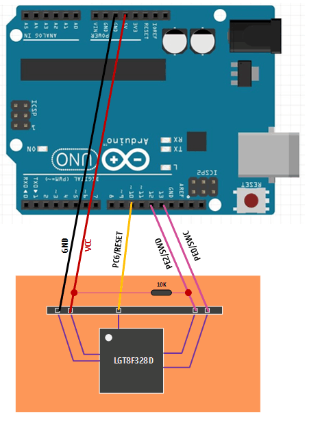

**[中文](README_zh.md)**
# Nulllab & Arduino as ISP
LGT8Fx8P serials chip ISP download protocol implementation

## Introduction
This is an implementation of LGT8Fx8P ISP download protocol. You can make arduino board or nulllab boards(base on lgt328p) as ISP for programing LGT8Fx8P.

## Usage
1. Make a ISP:
   1. Burn Lgt328P_ISP.ino into arduino board or lgt328p boards.
   2. Short `RESET` pin and `VCC` pin of arduino board to avoid bootloader executing.
   3. The arduino/nulllab board becomes a LGTISP now! Connect `SWD` and `SWC`. `RST` can be either connect or not.
      | Arduino Uno/Nano/ Nulllab boards|| LGT |
      |:-:|:-:|:-:|
      | D13 | -> | SWC |
      | D12 | -> | SWD |
      | D10 | -> | RST |

2. Burn bootloader into LGT8Fx8P:
   1. install [Arduino IDE for lgt328p](https://github.com/nulllaborg/arduino_nulllab).
   2. change **Board** to LGT8Fx8P.
   3. change **Programmer** to **Arduino/Nulllab as ISP**.
   4. click **Burn Bootloader**!

