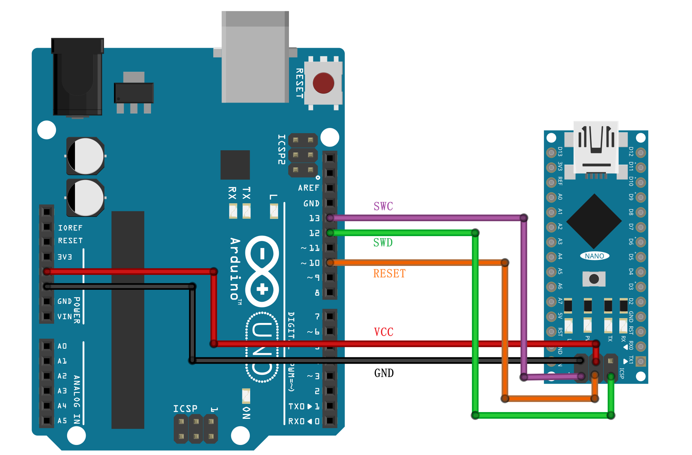
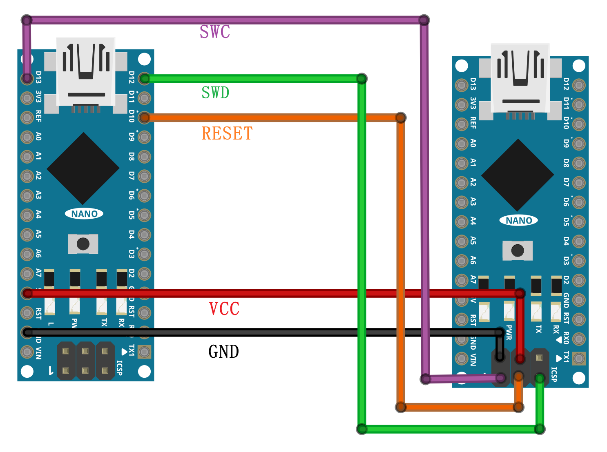
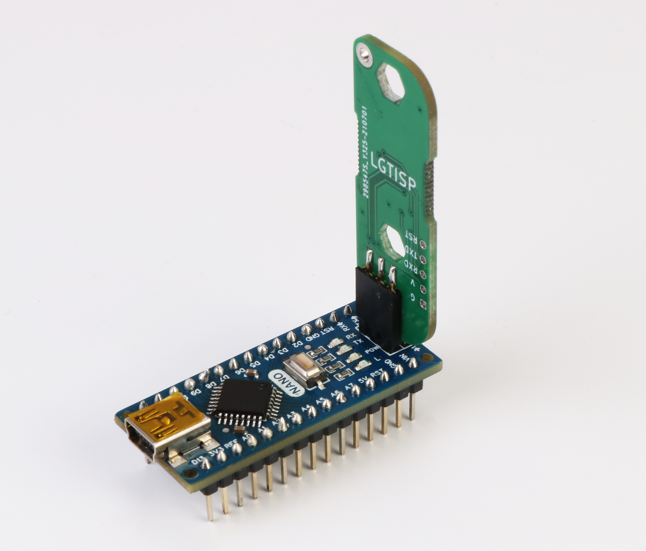
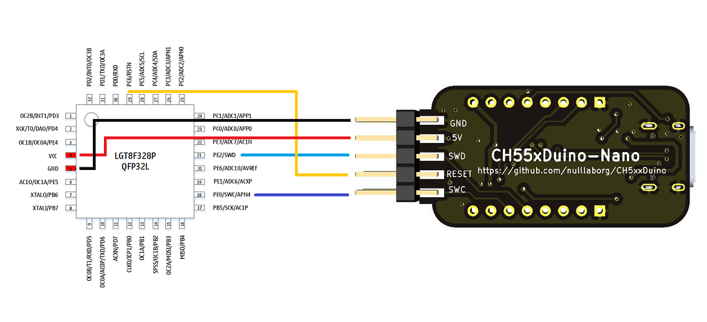
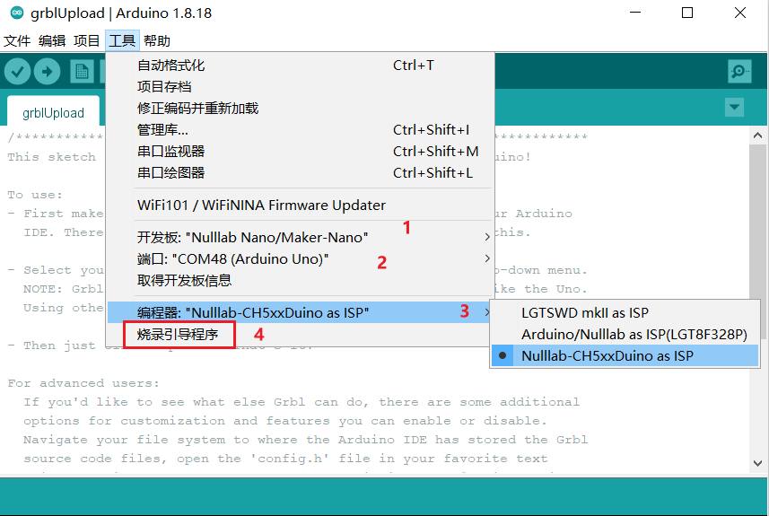
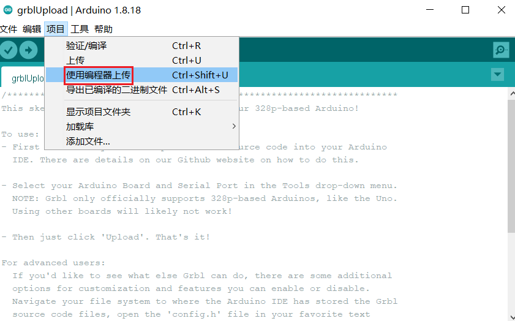
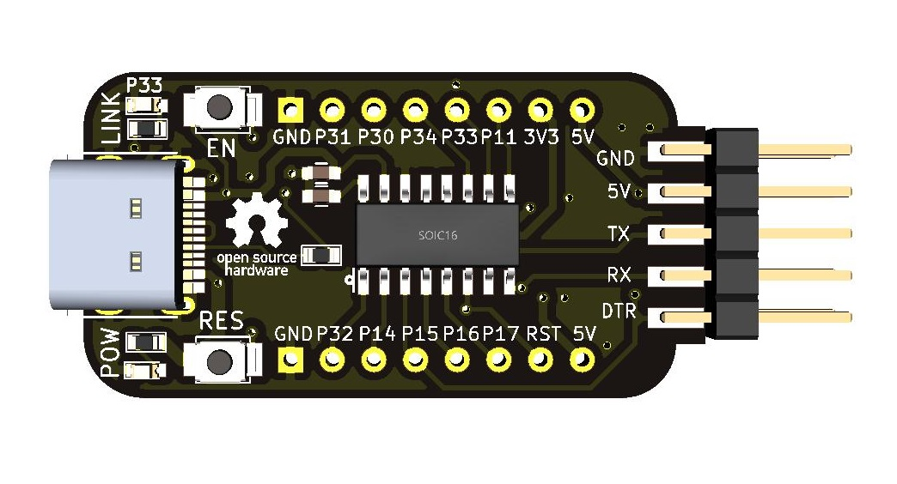

**[English](README.md)**

# 前言
​		在开发过程中，遇到短路，过压，误操作flash等情况下，Arduino Bootloader会有极低概率存在Bootloader损坏或者丢失情况，导致使用Arduino IDE上传程序失败，这个时候我们需要一些工具和方法来重烧bootloader。
​		此文档详细介绍了四种方法给LGT8F328P芯片下载bootloader的方法。您可以使用官方Arduino Uno主板或Nulllab-Nano板(基于lgt328p)作为ISP(编程器)来个LGT8F328P的芯片烧录引导程序，或者直接使用LGT8F328P专用ISP下载器来烧录。

## 一、官方Arduino Uno给LGT-Nano烧录bootloader

### 使用说明

1、使用Arduino Uno(Atmega328P主芯片)制作成ISP

- 1.安装 [Arduino IDE for lgt328p](https://github.com/nulllaborg/arduino_nulllab)
- 2.打开**[Lgt328P_ISP.ino](./Lgt328P_ISP.ino)** 应用程序(主板先选择Nulllab Nano然后通过IDE里面 *文件->示例->Lgt328P_ISP*)
- 2.工具->开发板->开发板管理->Arduino AVR Boards->Arduino Uno然后上传程序到Arduino Uno主板中
- 3.按如下图接线

| Arduino Uno(Atmega328P) |      |Nulllab-Nano(LGT8F328P)|
| :---------: | :--: | :--: |
|     D13     |  ->  | SWC  |
|     D12     |  ->  | SWD  |
|     D10     |  ->  | RST  |

 

2、通过Arduino Uno将Bootloader烧录到LGT8Fx8P：

- 1.选择开发板：工具->开发板->开发板管理->Nulllab AVR Compatible Boards->Nulllab Nano
- 2.选择烧录器：工具->编程器->Arduino/Nulllab as ISP(LGT328P）
- 3.点击*工具->烧录引导程序*

## 二、Nulllab-Nano(LGT8F328P)给Nulllab-Nano(LGT8F328P烧录bootloader

### 使用说明
 1、Nulllab-Nano制作成ISP：

- 1.安装 [Arduino IDE for lgt328p](https://github.com/nulllaborg/arduino_nulllab)
- 2.打开打开**[Lgt328P_ISP.ino](./Lgt328P_ISP.ino)** 应用程序 (可以通过IDE里面*文件-->示例-->Lgt328P_ISP*)
- 3.选择开发板：工具->开发板->开发板管理->Nulllab AVR Compatible Boards->Nulllab Nano 然后上传程序到LGT-Nano中
- 4.按如下图接线

| Nullab-Nano boards |      | (Nullab-Nano)LGT8F328P  |
| :---------: | :--: | :--: |
|     D13     |  ->  | SWC  |
|     D12     |  ->  | SWD  |
|     D10     |  ->  | RST  |

 2、将bootloader烧录到 LGT8Fx8P：

- 1.选择烧录器：工具->编程器->Arduino/Nulllab as ISP(LGT328P）
- 3.点击*工具->烧录引导程序*

## 三、使用LGT专用bootloader工具烧录

### 使用说明
 为了批量生产，或者维修方便，Nulllab开发了LGT8F328P专门的工具，只需要上电后，将烧录工具的1脚对应LGT-Nano烧录接口1脚插入，可以看见红绿灯交替闪烁，直至绿灯常亮即可，如果出现红灯代表烧录失败。

## 四、LGT-ISP工具

为了方便开发者开发量产基于LGT8F328P Arduino应用程序，nulllab开发了一款SWD烧录，串口上传二合一工具

SWD烧录连线如下图

1、烧录bootloader

2、由于LGT8F328P的在使用eerom情况下，如果还要使用bootloader那么实际使用flash大小只有32k-2k(模拟eerom)-1k(bootloader) = 29k，在很多场景下比如grbl，T12等大型项目使用 flash不够用，那么我们可以使用bootloader，这样我们也需要借助编程器直接上传程序

如下图

3、上传完bootloader后，我们可以同样使用LGT-ISP的串口功能，用Arduino IDE上传应用程序

| LGT-ISP |      |    (LGT8F328P)     |
| :-----: | :--: | :----------------: |
|   TX    |  ->  |        RX/0        |
|   RX    |  ->  |        TX/1        |
|   DTR   |  ->  | 串接100nf电容接RST |

 

